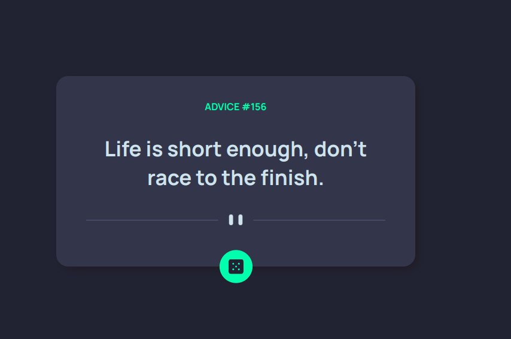

# Advice Generator App Solution

This is my solution to the [Advice generator app challenge on Frontend Mentor](https://www.frontendmentor.io/challenges/advice-generator-app-QdUG-13db). 

## Overview

This project involved building an advice generator app that fetches data from the advice API.

 ## The Challenge

- Implemented CSS elements and ensured the design is mobile responsive
- Implemented hover states in the button element
- Added the functionality that fetches data from an API and display the data on the UI with ReactJS

 ## Screenshot

  

- [Links](#links)
  - Solution URL: [Add solution URL here](https://your-solution-url.com)
  - Live Site URL: [Add live site URL here](https://your-live-site-url.com)

- [Built with](#built-with)

  - CSS custom properties
  - React JS
  - Mobile-first workflow
  - [React](https://reactjs.org/) - JS library

## What i learned

   - I learnt how to render data using the fetch API and the useEffect Hook
   - I also learnt how to position elements with the transform-translate CSS property
  
## Useful Resources

  - https://statusneo.com/different-ways-to-fetch-data-from-api-in-reactjs/
- [Author]() - Catherine Kiiru

